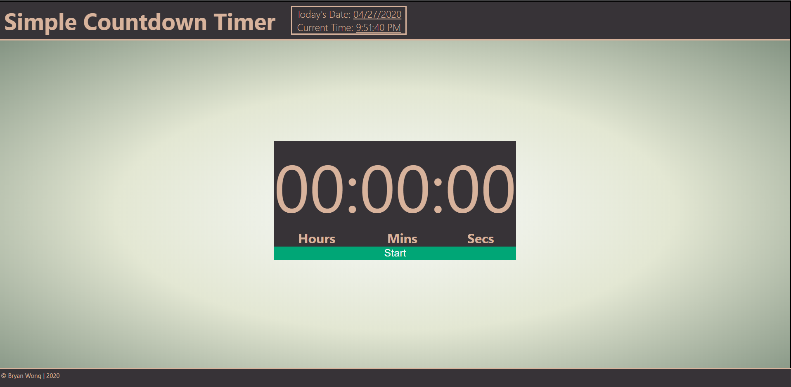
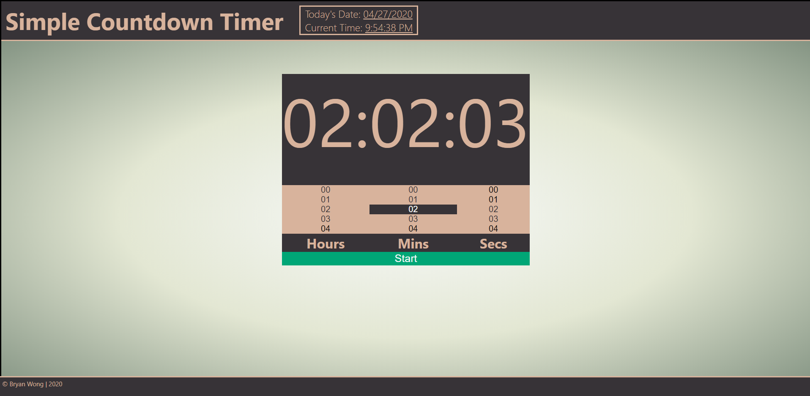
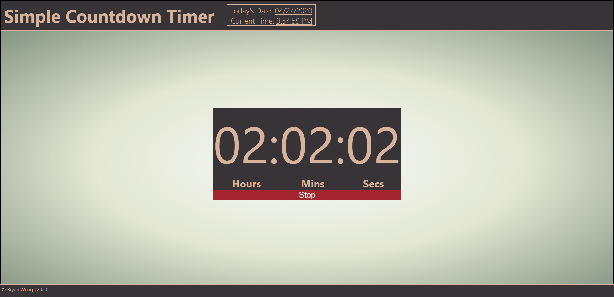

# Simple Coundown Timer 

### Website: http://www.simple-countdown-app.now.sh

A simple countdown timer responsive on different devices (even on mobile phones). To run, type command "run next dev" onto terminal.

## How To Use The Timer

#### Step 1: Load The App

#### Step 2: Click On The Time Display And Scroll To Select Times

#### Step 3: Click The Start Button

#### Step 4: Upon Reaching Zero, Click Anywhere To Silence The Alarm

## Notes

* For a quick reset, simply reload the App
* Clicking the display to show the time pickers will stop the countdown